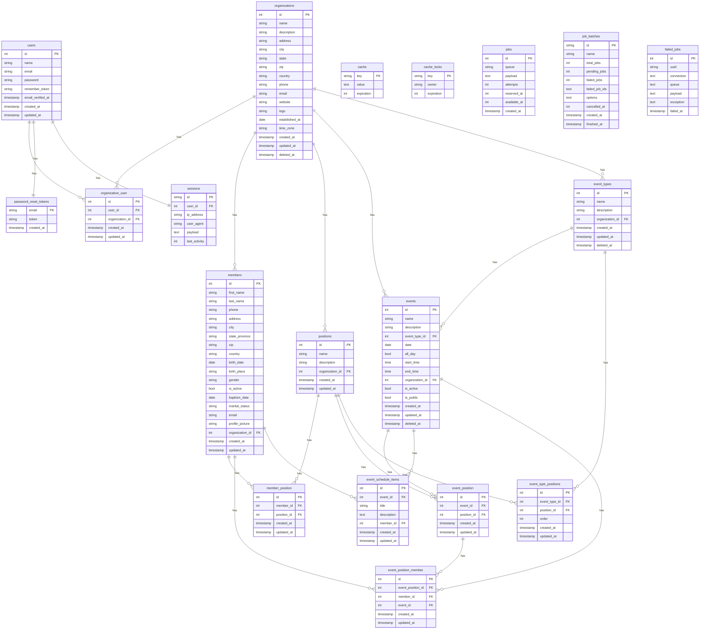

## ER Diagram

```mermaid
erDiagram
    users ||--o{ organization_user : has
    users ||--|| password_reset_tokens : has
    users ||--|| sessions : has
    users {
        int id PK
        string name
        string email
        string password
        string remember_token
        timestamp email_verified_at
        timestamp created_at
        timestamp updated_at
    }

    password_reset_tokens {
        string email PK
        string token
        timestamp created_at
    }

    sessions {
        string id PK
        int user_id FK
        string ip_address
        string user_agent
        text payload
        int last_activity
    }

    organizations ||--o{ organization_user : has
    organizations ||--o{ members : has
    organizations ||--o{ positions : has
    organizations ||--o{ events : has
    organizations ||--o{ event_types : has
    organizations {
        int id PK
        string name
        string description
        string address
        string city
        string state
        string zip
        string country
        string phone
        string email
        string website
        string logo
        date established_at
        string time_zone
        timestamp created_at
        timestamp updated_at
        timestamp deleted_at
    }

    organization_user {
        int id PK
        int user_id FK
        int organization_id FK
        timestamp created_at
        timestamp updated_at
    }

    members ||--o{ member_position : has
    members ||--o{ event_position_member : has
    members ||--o{ event_schedule_items : has
    members {
        int id PK
        string first_name
        string last_name
        string phone
        string address
        string city
        string state_province
        string zip
        string country
        date birth_date
        string birth_place
        string gender
        bool is_active
        date baptism_date
        string marital_status
        string email
        string profile_picture
        int organization_id FK
        timestamp created_at
        timestamp updated_at
    }

    positions ||--o{ member_position : has
    positions ||--o{ event_position : has
    positions ||--o{ event_type_positions : has
    positions {
        int id PK
        string name
        string description
        int organization_id FK
        timestamp created_at
        timestamp updated_at
    }

    member_position {
        int id PK
        int member_id FK
        int position_id FK
        timestamp created_at
        timestamp updated_at
    }

    event_types ||--o{ events : has
    event_types ||--o{ event_type_positions : has
    event_types {
        int id PK
        string name
        string description
        int organization_id FK
        timestamp created_at
        timestamp updated_at
        timestamp deleted_at
    }

    event_type_positions {
        int id PK
        int event_type_id FK
        int position_id FK
        int order
        timestamp created_at
        timestamp updated_at
    }

    events ||--o{ event_position : has
    events ||--o{ event_schedule_items : has
    events ||--o{ event_position_member : has
    events {
        int id PK
        string name
        string description
        int event_type_id FK
        date date
        bool all_day
        time start_time
        time end_time
        int organization_id FK
        bool is_active
        bool is_public
        timestamp created_at
        timestamp updated_at
        timestamp deleted_at
    }

    event_position ||--o{ event_position_member : has
    event_position {
        int id PK
        int event_id FK
        int position_id FK
        timestamp created_at
        timestamp updated_at
    }

    event_position_member {
        int id PK
        int event_position_id FK
        int member_id FK
        int event_id FK
        timestamp created_at
        timestamp updated_at
    }

    event_schedule_items {
        int id PK
        int event_id FK
        string title
        text description
        int member_id FK
        timestamp created_at
        timestamp updated_at
    }

    cache {
        string key PK
        text value
        int expiration
    }

    cache_locks {
        string key PK
        string owner
        int expiration
    }

    jobs {
        int id PK
        string queue
        text payload
        int attempts
        int reserved_at
        int available_at
        timestamp created_at
    }

    job_batches {
        string id PK
        string name
        int total_jobs
        int pending_jobs
        int failed_jobs
        text failed_job_ids
        text options
        int cancelled_at
        timestamp created_at
        timestamp finished_at
    }

    failed_jobs {
        int id PK
        string uuid
        text connection
        text queue
        text payload
        text exception
        timestamp failed_at
    }

```
